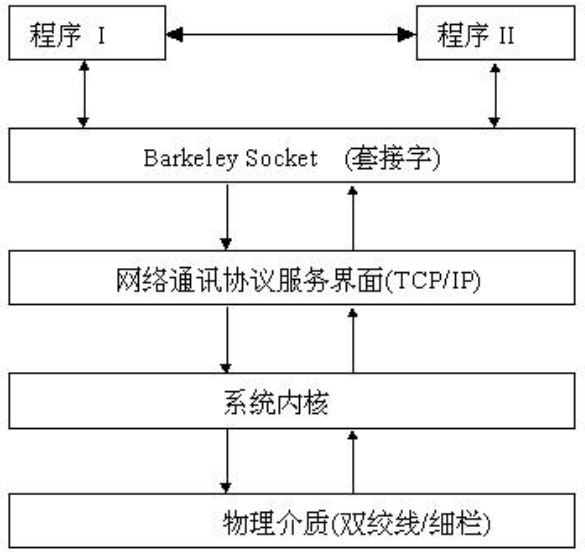
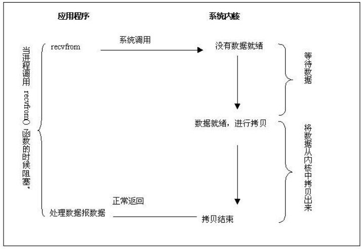
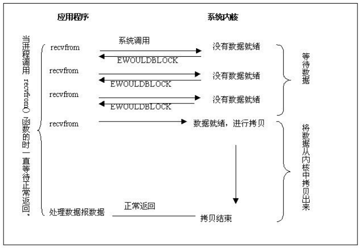
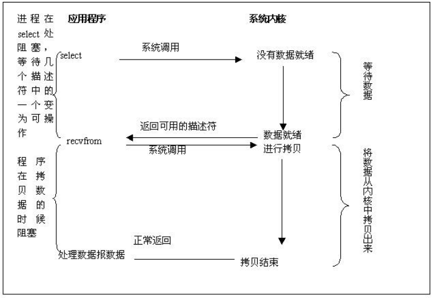
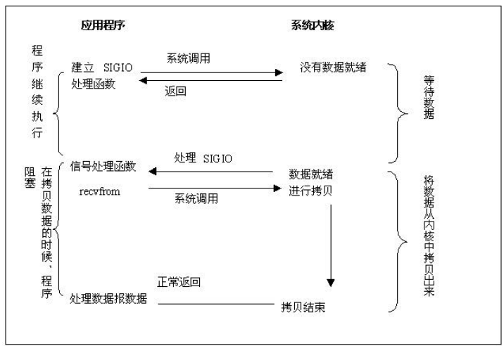
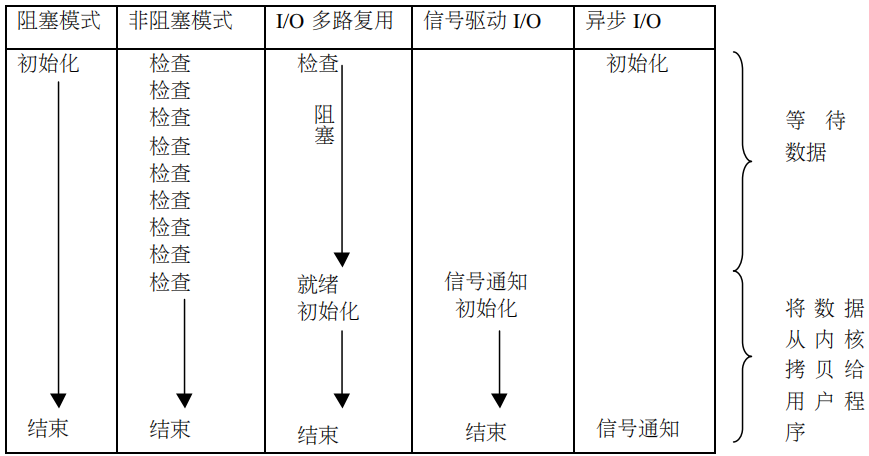
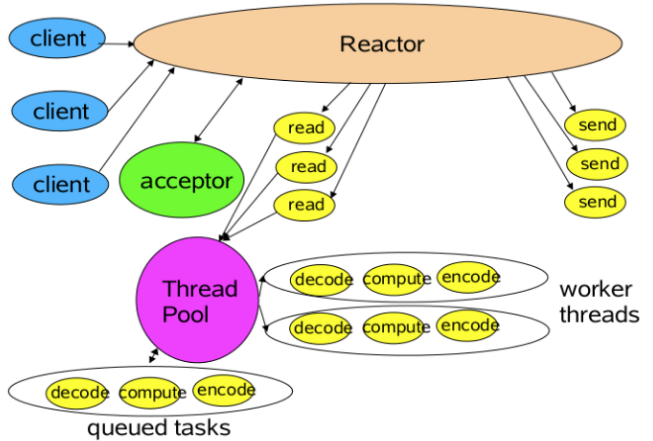

# Asynchronous (异步)
本文介绍Java中的IO模型。

Java中的BIO、NIO、AIO等各种API，可以理解为是对操作系统的各种IO模型的封装，使得程序员在使用时能够不必关心操作系统层面的知识。明白这一点很重要，千万不要以为是Java自己实现了这些模型。

Java中提供的IO有关的API，在文件处理的时候，其实依赖操作系统层面的IO操作实现的。比如在Linux 2.6以后，Java中NIO和AIO都是通过epoll来实现的，而在Windows上，AIO是通过IOCP来实现的。


## 《Linux网络编程》第六章读书笔记
### 背景知识介绍

Linux中网络程序设计完全靠套接字接受和发送消息，Socket是一个接口，它在系统中的位置如下。



每一个socket都有一个本地的socket号，由操作系统分配。Socket是面向客户端-服务端模式设计的，且针对服务端和客户端提供了不同的socket调用。两端差异如下:


socket有TCP和UDP两种类型，我们这里只关心TCP

### 套接字地址

在Linux中，docket到底是什么呢 —— 它是通过标准的Unix文件描述符和其它的程序通讯的一个方法

在Unix中，任何东西都是一个文件，在Unix中，任何针对I/O的操作，都是通过读或写一个文件描述符来实现的。

套接字使用方式：调用系统函数socket()，他返回一个Socket描述符，然后针对次描述符执行系统函数进行数据的收发。与套接字相关的调用如下

- socket()
- bind()
- connect()
- listen()
- accept()
- send() - 针对TCP的发送
- recv() - 针对TCP的接收
- sendto() - 针对UDP的发送
- recvfrom() - 针对UDP的接收
- close()
- ......

### 端口介绍

系统有1024个保留端口，他们是留给系统使用的，只有root用户才能使用1024以内的端口。可以在/etc/services文件中查看系统默认的端口设置情况。

检测一个端口是否被占用的绝佳方式——telnet，如果telnet是拒绝连接，则说明该端口没有被占用。同样，在调试客户端-服务端程序时候telnet也非常有用。可以用它来测试服务端有没有启动。

```bash
> telnet 127.0.0.1 8080
```

### 五种IO模式

Linux/UNIX系统中，有如下五种IO模式

- 阻塞I/O
- 非阻塞I/O
- I/O多路复用
- 信号驱动I/O（SIGIO）
- 异步I/O

对于一个套接字的输入操作，一般分为两步。这是大前提，五种IO模式都是在这上面做文章的。

- 等待数据从网络到达本地，当数据到达后，系统将数据从网络层拷贝到内核的缓存
- 将数据从内核的缓存拷贝到应用程序的数据区中

#### 阻塞I/O

缺省模式，一个socket建立后自动处于阻塞I/O模式。如下图，阻塞I/O大致流程为

- 调用recvfrom发起数据接收
- 内核尚未收到数据，于是阻塞等待
- 内核收到数据（数据到了内核缓存），将数据从内核缓存拷贝到应用程序数据区
- 拷贝完成，recvfrom返回，应用程序处理数据



#### 非阻塞I/O

设置为此模式后，相当于告诉内核：当我请求的IO不能马上返回时，不要让我的进程进入休眠，而是返回一个错误给我。而为了能够及时收到数据，应用程序需要循环调用recevfrom来测试一个文件描述符（创建socket时生成）是否有数据可读。这称作polling。应用程序不停滴polling是一个浪费CPU的操作，因此这种模式不是很普遍。

- 调用recvfrom发起数据接收
- 内核尚未收到数据，响应应用程序EWOULDBLOCK错误，而内核自己则继续等待数据
- 多次调用recvfrom询问内核数据是否准备好。
- 当数据终于准备好时，内核将数据拷贝到应用程序数据区，返回recvfrom
- 应用程序处理数据



#### I/O多路复用

此模式下，在开始接收数据之前，我们不是调用recvfrom函数，而是调用select函数或poll函数，当他们有响应时，再调用recvfrom接收数据，调用select函数时也会阻塞，但它的优点在于，能够同时等待多个文件描述符，只要有一个准备好了，select就会返回。I/O多路复用经常被使用。

- 调用select，阻塞等待直到有文件描述符的数据就绪
- 有就绪的文件描述符，select返回，应用程序调用recvfrom接收数据
- 内核将数据拷贝到应用程序数据区，返回recvfrom
- 应用程序处理数据



##### 关于select

select函数可以同时监视多个套接字，它能够告诉你哪一个套接字已经可以读取数据、哪一个套接字已经可以写入数据、哪一个套接字出现了错误等。

##### epoll

select和poll的使用有较大的局限性，无法满足并发量特别高的情况，epoll是对他们的增强。增强的原理这里不深究。

#### 信号驱动I/O

该模式将内核等待数据这段时间变主动为被动，在数据就绪时使用SIGIO（或SIGPOLL）信号通知我们。

使用方法上，让套接字工作在信号驱动I/O工作模式中，并安装一个SIGIO处理函数。这样在内核等待数据期间我们就是完全异步的情况了。只需要在SIGIO处理函数中接收数据处理即可。

- 创建套接字，允许工作在信号驱动模式，并注册SIGIO信号处理函数
- 内核数据就绪后，响应SIGIO信号
- 事先注册的SIGIO处理函数中调用recvfrom函数
- 内核将数据拷贝到应用程序数据区，返回recvfrom
- 应用程序处理数据

信号驱动I/O的编程有一个最大的难点是除了数据就绪外，还有很多触发SIGIO信号的场景，区分这些场景是难点。



#### 异步I/O

异步I/O模式下，我们只需要告诉内核我们要进行I/O操作，然后内核马上返回，具体的I/O操作和数据拷贝全部由内核完成，完成后再通知我们的应用程序。与信号驱动I/O所不同的是，这次不仅在等待数据阶段是异步的，连内核数据拷贝都是异步的。

- 创建套接字，工作在异步I/O模式，指定套接字文件描述符、数据需要拷贝到的缓冲区、回调函数等，不需要等待，马上返回
- 内核负责等待数据病将数据从内核缓冲区拷贝到应用程序数据区
- 内核拷贝结束后，回调第一步注册的函数，完成应用程序的数据处理


#### 五种模式总结

前四种模式都有阻塞的地方——将数据从内核拷贝到应用程序数据区，只有第五种是完全异步的。




## Java的IO

Java的IO有三种

- BIO

  即传统的Socket API，阻塞等待

- NIO

  引入了多路选择器Selector、通道Channel、缓存区ByteBuffer的概念。通过轮询选择器的方式获取准备好的Channel，数据读取均采用ByteBuffer。

  注意，select()方法是阻塞的，因此使用while(true)时候不会有CPU空转的风险。

  **实现上，Linux 2.6之前是select、poll，2.6之后是epoll，Windows是IOCP**

- NIO2 (AIO)

  异步IO，使用时只需要注册一个处理函数即可。在数据接收完成后系统会调用回调函数进行处理。

  相比NIO的优势在于可

## Java NIO

### 基于NIO构建事件驱动模型

NIO的Selector能够响应多个不同的事件

- ACCEPT
- CONNCET
- READ
- WRITE

针对感兴趣的事件注册事件处理器，单线程轮训Selector，事件到达时执行事件处理器——这就是最简单的Reactor模式

这种最简单的Reactor模式已经能够带来性能上的巨大提升。但考虑到现在的CPU都是多核，因此加入多线程非常有必要，需要的线程主要包括以下几种：

- 事件分发器，单线程选择就绪的事件。

- I/O处理器，包括connect、read、write等，这种纯CPU操作，一般开启CPU核心个线程就可以。

- 业务线程，在处理完I/O后，业务一般还会有自己的业务逻辑，有的还会有其他的阻塞I/O，如DB操作，RPC等。只要有阻塞，就需要单独的线程。

从而有如下示意图的模型。



### 问题

NIO != 高性能，当连接数小于1000、并发程度不高时，NIO并没有显著的性能优势。

NIO并没有完全屏蔽平台差异，它仍然是基于各个操作系统的I/O系统实现的，差异仍然存在。使用NIO做网络编程构建事件驱动模型并不容易，陷阱重重。

推荐大家使用成熟的NIO框架，如Netty，MINA等。解决了很多NIO的陷阱，并屏蔽了操作系统的差异，有较好的性能和编程模型。

# 需要搞清楚的问题

1. Java中各种IO的概念：BIO、NIO、AIO （完成）
2. Linux中的五种IO模型 （完成）
3. Java的IO模型和Linux、Windows中的IO模型是如何对应的 （完成）
4. EventLoop、Actor、Reactor基本概念；还有其它类似的概念吗？
5. EventLoop、Actor、Reactor和Java的IO模型有什么关系
6. Netty中如何对应了Java的NIO模型
7. Vertx的异步模型如何对应Java的NIO模型

# 参考资料
1. 《Linux程序设计》
2. 《Linux五种IO模型》(https://mp.weixin.qq.com/s?__biz=Mzg3MjA4MTExMw==&mid=2247484746&idx=1&sn=c0a7f9129d780786cabfcac0a8aa6bb7&source=41#wechat_redirect)
3. 《Java NIO BIO AIO简单总结》(https://github.com/Snailclimb/JavaGuide/blob/master/docs/java/BIO-NIO-AIO.md#1-bio-blocking-io)
4. 《Java并发编程实战》
5. 《Java网络编程》- 第六章

6. https://zhuanlan.zhihu.com/p/23488863